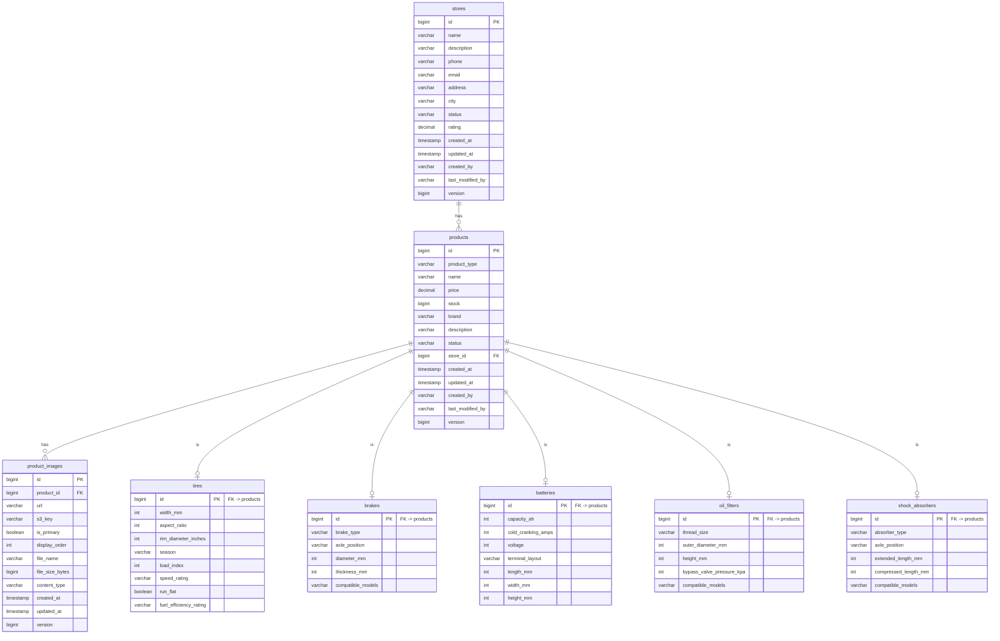

# Entity Relationship Diagram

## Inheritance Strategy

`products` uses **JOINED** table inheritance with a `product_type` discriminator column.
Each subtype table shares the same PK as `products` and only stores its own specific columns.

## Enums

| Entity | Column | Values |
|---|---|---|
| products | status | ACTIVE, INACTIVE, OUT_OF_STOCK, DISCONTINUED |
| stores | status | ACTIVE, INACTIVE, SUSPENDED, CLOSED |
| tires | season | SUMMER, WINTER, ALL_SEASON, ALL_WEATHER |
| brakes | brake_type | DISC, DRUM |
| shock_absorbers | absorber_type | GAS, OIL, ELECTRONIC |
| product_images | content_type | IMAGE_JPEG, IMAGE_PNG, IMAGE_WEBP |
